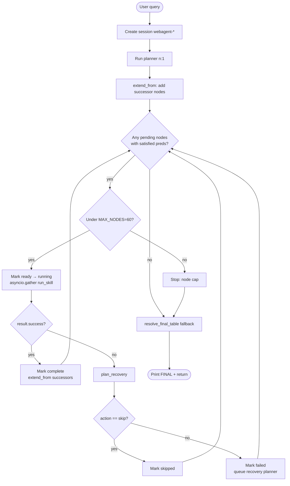
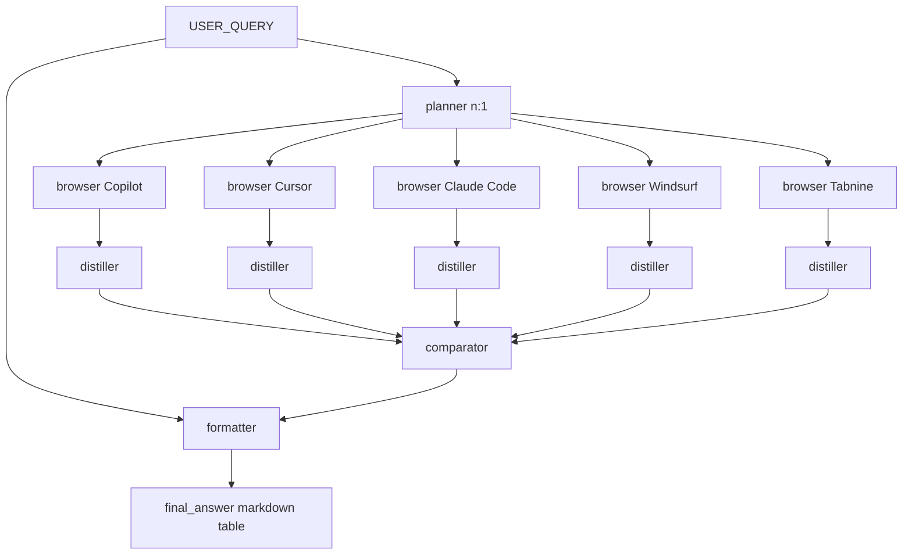
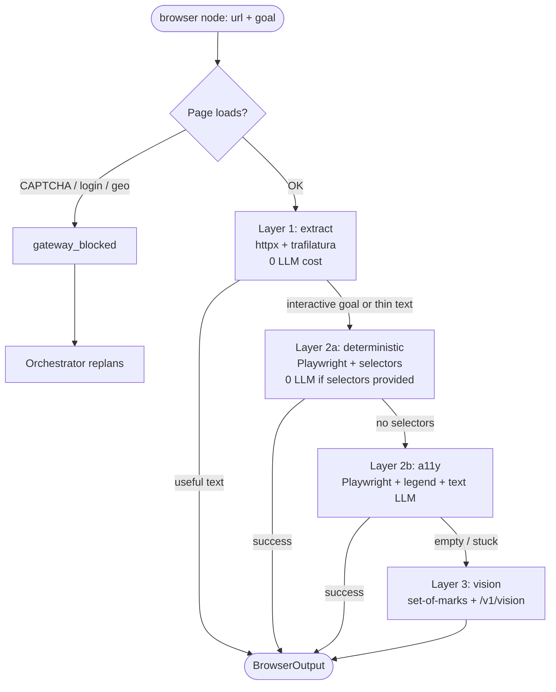
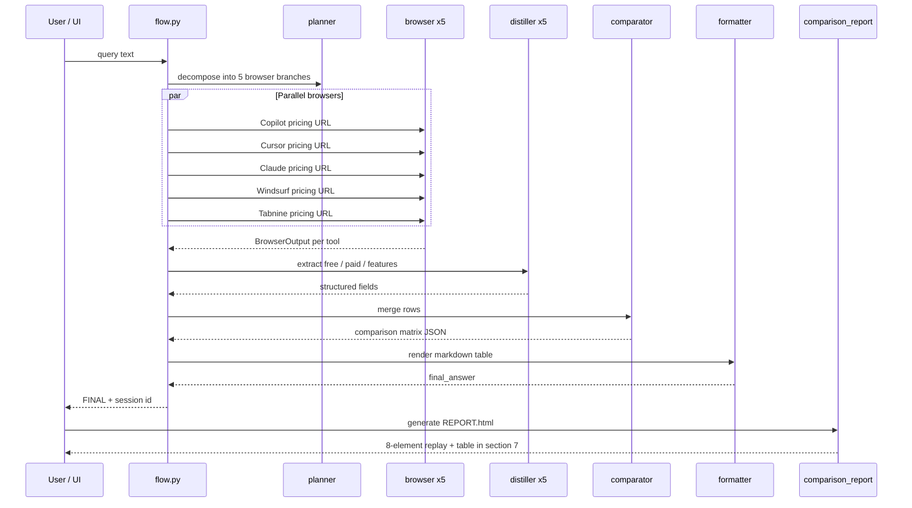
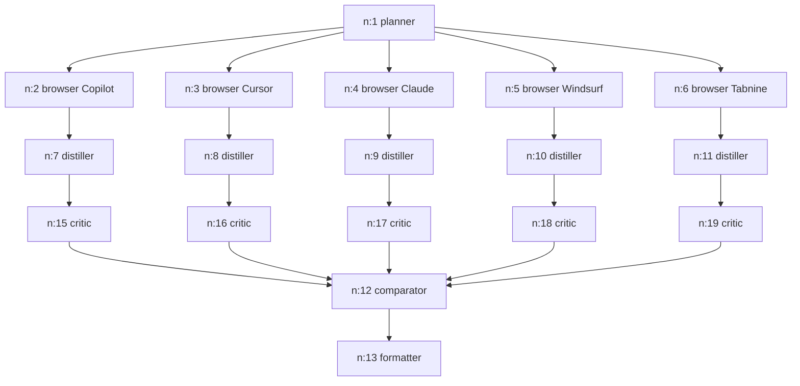
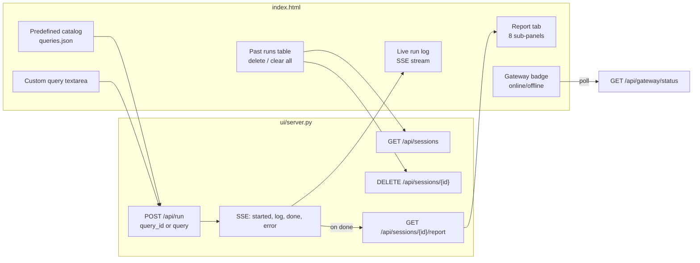

# Web Agent — Session 9 v2

A **growing-graph agent runtime** that decomposes user queries into a dynamic DAG of skills, executes them in parallel where possible, persists every step to disk, and produces a replayable HTML report. The flagship demo is a **five-tool AI coding pricing comparison** (GitHub Copilot, Cursor, Claude Code, Windsurf, Tabnine) using the Browser skill’s cost cascade and a comparator → formatter pipeline.

---

## Table of contents

1. [Repository layout](#repository-layout)
2. [System architecture](#system-architecture)
3. [Control flow](#control-flow)
4. [Components](#components)
5. [Skills catalogue](#skills-catalogue)
6. [Browser cost cascade](#browser-cost-cascade)
7. [Comparison task pipeline](#comparison-task-pipeline)
8. [Recovery and resilience](#recovery-and-resilience)
9. [Session persistence and reports](#session-persistence-and-reports)
10. [Example run walkthrough](#example-run-walkthrough-comparison-task)
11. [Web UI](#web-ui)
12. [Environment configuration](#environment-configuration)
13. [Prerequisites and setup](#prerequisites-and-setup)
14. [Running the demo](#running-the-demo)
15. [CLI usage](#cli-usage)
16. [Testing](#testing)
17. [Further reading](#further-reading)

---

## Repository layout

```
Session 9 v2/
├── README.md                 ← this file
├── DESIGN_PLAN.md            ← full design rationale and file-status map
├── .env.example              ← gateway provider keys (copy to .env)
├── run_demo.ps1              ← Windows demo launcher
├── run_demo.sh               ← Unix demo launcher
├── logs/                     ← gateway.log, per-query logs (runtime)
│
├── llm_gatewayV9/            ← LLM gateway (port 8109)
│   ├── main.py                 ← soft routing + failover candidates
│   ├── client.py
│   ├── agent_routing.yaml      ← per-skill provider preferences (soft pins)
│   ├── scripts/
│   │   ├── benchmark_nvidia_models.py
│   │   └── benchmark_nvidia_results.json
│   └── tests/test_agent_routing.py
│
├── artifacts/                  ← saved report snapshots (e.g. Comparison Task.html)
│
└── code/                     ← Web Agent runtime
    ├── flow.py               ← orchestrator (Graph + Executor)
    ├── skills.py             ← skill registry + run_skill dispatcher
    ├── recovery.py           ← failure classification + skip/replan
    ├── persistence.py        ← SessionStore, on-disk nodes/graph
    ├── comparison_report.py  ← 8-element replay + REPORT.html
    ├── gateway.py            ← bridge to llm_gatewayV9
    ├── agent_config.yaml     ← skill catalogue
    ├── schemas.py            ← AgentResult, BrowserOutput, NodeState, …
    ├── prompts/              ← one markdown prompt per skill
    ├── browser/              ← Browser skill implementation
    │   ├── skill.py          ← cascade wrapper
    │   ├── driver.py         ← a11y + vision drivers
    │   ├── dom.py            ← interactive-element legend
    │   └── highlight.py      ← set-of-marks (Pillow)
    ├── ui/
    │   ├── server.py         ← FastAPI + SSE
    │   ├── queries.json      ← prefab query catalog
    │   └── static/index.html ← single-page UI
    ├── state/sessions/       ← runtime session data (gitignored in practice)
    └── tests/                ← pytest suite
```

---

## System architecture

High-level view of how the demo stack fits together:

```mermaid
flowchart TB
    subgraph User
        BrowserUI[Web UI :8090]
        CLI[run_demo.ps1 / flow.py CLI]
    end

    subgraph WebAgent["code/ — Web Agent"]
        UI[ui/server.py]
        Flow[flow.py Executor]
        Skills[skills.py]
        Persist[persistence.py]
        Report[comparison_report.py]
        BrowserSkill[browser/skill.py]
    end

    subgraph Gateway["llm_gatewayV9 :8109"]
        Chat[/v1/chat]
        Vision[/v1/vision]
        Cost[/v1/cost/by_agent]
        Embed[/v1/embed]
    end

    subgraph External
        WebPages[Pricing pages]
        Ollama[Ollama embeddings]
        Providers[Gemini / Groq / GitHub / …]
    end

    BrowserUI --> UI
    CLI --> Flow
    UI -->|subprocess SSE| Flow
    Flow --> Skills
    Skills --> Chat
    Skills --> BrowserSkill
    BrowserSkill --> Vision
    BrowserSkill --> WebPages
    Chat --> Providers
    Vision --> Providers
    Embed --> Ollama
    Flow --> Persist
    UI --> Report
    Report --> Persist
    Report --> Cost
    Flow -->|ensure_gateway| Gateway
```

**Ports**

| Service | URL | Role |
|---------|-----|------|
| Web UI | http://127.0.0.1:8090 | Query catalog, live log, report viewer |
| LLM Gateway V9 | http://localhost:8109 | All LLM and vision calls, cost tracking |
| Ollama (optional) | http://localhost:11434 | Local embeddings for memory / FAISS |

---

## Control flow

### Executor loop (`flow.py`)

The orchestrator is a **ready-node scheduler** over a growing NetworkX graph:



**Predecessor satisfaction:** a node becomes ready when every upstream node is in a **terminal** state: `complete`, `skipped`, or `failed`. That lets distillers and the comparator run even when some browser branches failed (e.g. gateway 502).

**Parallelism:** all nodes whose predecessors are satisfied run in the same `asyncio.gather` batch.

### Comparison task DAG (typical)

For the prefab **comparison** query, the planner usually emits a fan-out like this:



Distiller nodes have **`critic: true`** in `agent_config.yaml`, so the orchestrator may insert a **Critic** node on each distiller → comparator edge to validate extraction quality before merge.

---

## Components

### `flow.py` — Orchestrator

- **`Graph`**: NetworkX wrapper; nodes are `n:1`, `n:2`, … with `skill`, `inputs`, `metadata`, `status`.
- **`Executor.run(query)`**: main loop; creates `webagent-<uuid>` session, writes graph + nodes via `SessionStore`.
- **`extend_from`**: after a successful skill, adds successors from (1) the skill’s JSON output, (2) `internal_successors` in yaml, (3) critic auto-insertion.
- **Planner guards** (`skills.py`): if the planner returns empty JSON on Gemini, one retry; if the plan has **zero successors**, the node is marked failed (not a silent success).
- **Recovery**: on failure, calls `plan_recovery()` → `skip` (transient/validation) or `replan` (upstream failure → new planner node with `prior_complete` context). Zero-valid-node planner failures trigger an automatic replan once.
- **Output**: `formatter.output.final_answer`, or `resolve_final_table()` fallback from `comparison_report.py`.

### `skills.py` — Skill dispatcher

- Loads **`agent_config.yaml`** into a `SkillRegistry`.
- Resolves inputs: `USER_QUERY`, `n:3` (upstream node output), `art:…` (artifacts).
- Renders prompt templates from **`prompts/*.md`**, calls gateway `LLM().chat()` with optional MCP tools.
- **Browser branch**: delegates to `browser/skill.py` (not a standard chat call).
- Parses model output as a single JSON object → `AgentResult`.

### `recovery.py` — Failure policy

| Failure class | Typical cause | Action |
|---------------|---------------|--------|
| `transient` | 502/503/504, timeout | **skip** (mark node `skipped`) |
| `validation_error` | malformed JSON / NodeSpec | **skip** |
| `upstream_failure` on planner | bad plan | **skip** |
| `upstream_failure` on other skills | empty research, blocked page | **replan** (recovery planner) |

Critic **fail** verdicts are handled separately (`handle_critic_verdict`) with a per-branch retry cap.

### `persistence.py` — Session store

Each run creates:

```
code/state/sessions/<session_id>/
├── query.txt
├── graph.pkl              # NetworkX graph snapshot
├── nodes/n_001.json       # NodeState per node
├── browser/browser_<ts>/  # screenshots, legends per turn
└── REPORT.html            # generated after run (comparison_report)
```

Supports **delete session** / **delete all** (used by UI and tests).

### `comparison_report.py` — Replay report

Read-only; never orchestrates. Produces **eight elements**:

1. User goal  
2. Planner DAG (Mermaid + text)  
3. Browser paths  
4. Browser actions  
5. Page-state logs (screenshots embedded as base64 in HTML)  
6. Extracted data (distiller fields)  
7. Final comparison table (formatter, comparator, or **partial fallback**)  
8. Turn counts + cost by agent (from gateway `/v1/cost/by_agent`)

CLI:

```bash
cd code
uv run python comparison_report.py <session_id>
uv run python comparison_report.py --list
```

### `gateway.py` — Gateway bridge

- Discovers `llm_gatewayV9/` by walking parents for `client.py`.
- **`ensure_gateway()`**: auto-starts gateway on **8109** if down.
- Exports **`LLM`** client and **`embed()`** for memory/FAISS.

### `llm_gatewayV9/` — LLM Gateway

- Unified chat routing across configured providers (Gemini, Groq, NVIDIA NIM, Cerebras, GitHub Models, etc.).
- **`POST /v1/vision`**: image + prompt for Browser layer 3.
- **`GET /v1/cost/by_agent?session=&agent=`**: USD cost ledger for reports.
- Loads **`.env` from the repo root** (`Session 9 v2/.env`).
- **`agent_routing.yaml`**: **soft preferences** per skill — tries the preferred provider first, then walks a failover ring on 5xx/cooldown (see `main.py` `_failover_candidates()`).
- **`agent_config.yaml` `provider_pin: gemini` on planner**: hard pin at the skill layer so planner JSON never fails over to weaker models.

**Recommended NVIDIA fan-out model** (from `benchmark_nvidia_models.py`):

| Model | Planner JSON | Distiller JSON | Burst 6× | Notes |
|-------|--------------|----------------|----------|-------|
| `mistralai/mistral-small-4-119b-2603` | 100% | 100% | 6/6 | **Default `NVIDIA_MODEL`** — fast distiller (~0.7s) |
| `gemini-3.1-flash-lite` | 100% | 100% | — | Baseline; keep for planner/formatter |
| `qwen/qwen3.5-122b-a10b` | **0%** | 100% | 5/6 | Avoid for planner failover — empty plans |

Re-run benchmark:

```powershell
cd llm_gatewayV9
uv run python scripts/benchmark_nvidia_models.py
```

### `browser/` — Browser skill

See [Browser cost cascade](#browser-cost-cascade). Entry point: `browser/skill.py`, invoked from `skills.py` when the planner emits a `browser` node with `metadata.url` and `metadata.goal`.

---

## Skills catalogue

Defined in **`code/agent_config.yaml`** + **`code/prompts/`**:

| Skill | Tools | Notes |
|-------|-------|-------|
| **planner** | — | Emits initial DAG and recovery subgraphs |
| **retriever** | search_knowledge | FAISS + memory search |
| **researcher** | web_search, fetch_url | General web research |
| **browser** | — | Own cascade; metadata: `url`, `goal` |
| **distiller** | — | Structured extraction; **critic: true** |
| **comparator** | — | Merges N distiller rows into one matrix |
| **summariser** | — | Short-form condensation |
| **critic** | — | pass/fail on upstream output |
| **formatter** | — | Terminal node; `final_answer` is user-facing output |
| **coder** | — | Emits code → **sandbox_executor** (internal successor) |
| **sandbox_executor** | — | Runs code in sandbox |

Adding a skill: new yaml entry + prompt file + (if needed) a dispatch branch in `skills.py`. Browser and Comparator demonstrate catalogue-only extension.

---

## Browser cost cascade

The Browser skill escalates **cheapest layer first** and stops when the goal is satisfied:



**Artifacts** per turn (under `state/sessions/<sid>/browser/`):

- `turn_NN_raw.png`, `turn_NN_marked.png` (vision)
- `turn_NN_legend.txt` (a11y interactive-element list)

**Pricing comparison** queries use **interactive goals** (toggle billing, read plans), so layers 1–2a usually skip quickly and **a11y or vision** dominates.

---

## Comparison task pipeline

End-to-end path for the prefab comparison query:



If formatter/comparator do not complete (gateway errors, partial fan-out), **`resolve_final_table()`** builds a **partial markdown table** from successful browser/distiller artifacts and labels the report accordingly.

---

## Recovery and resilience

Recent fixes address real demo failures:

1. **Graph deadlock** — `ready_nodes()` treats `failed` predecessors as terminal, so downstream distillers/comparator can still run with gaps.
2. **Skip marking** — transient failures (502/503) mark nodes **`skipped`**, not left as blocking `failed` after a skip decision.
3. **Partial tables** — `build_fallback_comparison_table()` + UI/report section 7 still show useful output when the formatter never ran.
4. **Empty planner plans** — planner retries once on Gemini if JSON is empty; zero-successor plans fail the node and trigger recovery replan instead of ending with an empty FINAL.
5. **Gateway failover** — soft routing in `llm_gatewayV9/main.py` spreads fan-out across Groq/NVIDIA instead of hammering a single low-RPM provider until 502/503.
6. **Streaming log** — UI runs `python -u flow.py` with `PYTHONUNBUFFERED=1` and correct SSE parsing so the live log updates during long browser runs.
7. **UTF-8** — persistence and console use UTF-8 so characters like `✓` in extracted pricing text do not crash Windows cp1252.

**Operational tip:** gateway stability matters for five parallel browser branches. Set `NVIDIA_MODEL=mistralai/mistral-small-4-119b-2603` in `.env`, restart the demo (`run_demo.ps1`), and retry if you see repeated 502/503 on `http://localhost:8109/v1/chat`. Check `logs/gateway.log`.

---

## Session persistence and reports

After any run:

| Path | Contents |
|------|----------|
| `code/state/sessions/<sid>/query.txt` | Original user query |
| `code/state/sessions/<sid>/nodes/*.json` | Full node state, prompts, results |
| `code/state/sessions/<sid>/browser/` | Screenshots and legends |
| `code/state/sessions/<sid>/REPORT.html` | Dark-theme replay report |

Regenerate a report without re-running:

```powershell
cd code
uv run python comparison_report.py webagent-<your-session-id>
```

Open in browser:

```
http://127.0.0.1:8090/api/sessions/<session_id>/report.html
```

---

## Example run walkthrough (comparison task)

The saved report [`artifacts/Comparison Task.html`](artifacts/Comparison%20Task.html) (session **`webagent-acb941cb`**) shows what a full comparison run looks like end-to-end. The Web UI **Report** tab and standalone `REPORT.html` expose the same **eight replay elements** documented below.

### 1 · Original user goal

The query stored in `query.txt` and shown at the top of every report:

> Compare GitHub Copilot, Cursor, Claude Code, Windsurf, and Tabnine as AI coding tools. For each, open its pricing page, switch the billing toggle if present, and report the free plan, the cheapest paid plan with its price, and three headline features. Give me a single comparison table.

This is also the prefab **Compare 5 AI coding tools** entry in `code/ui/queries.json`, or any custom text you paste into the UI sidebar.

### 2 · Planner DAG

The planner (`n:1`) emitted five parallel **browser** branches (one pricing URL per tool), each followed by **distiller → critic → comparator → formatter**. This run also **replanned** mid-flight (`n:14`, `n:32`, …) after upstream browser failures, which is why the full graph grew to **38 nodes** instead of the minimal ~13-node happy path.

Simplified view of the first plan (recovery subgraphs omitted):



Text edge list from the artifact (includes recovery replans):

```
n:1 (planner) -> n:2..n:6 (browser)
n:2..n:6 -> n:7..n:11 (distiller)
n:7..n:11 -> n:15..n:19 (critic)
n:15..n:19 -> n:12 (comparator)
n:12 -> n:13 (formatter)
n:14 (recovery planner) -> n:20..n:24 (browser retry)
…
```

### 3 · Browser path chosen

Each browser node records which **cascade layer** succeeded. Paths mean:

| Path | Meaning |
|------|---------|
| **extract** | Static HTTP + trafilatura text only (no LLM) |
| **deterministic** | Playwright with known selectors (no LLM) |
| **a11y** | Playwright + numbered interactive-element legend + text LLM |
| **vision** | Set-of-marks screenshot + `/v1/vision` |
| **blocked** | CAPTCHA, login wall, or geo block |
| **unknown** | Node failed before path was recorded |

From the artifact (first browser wave):

| Node | Path | Turns | Final URL |
|------|------|-------|-----------|
| n:2 | unknown | 0 | *(empty — Copilot branch failed early)* |
| n:3 | **a11y** | 2 | `https://cursor.com/pricing` |
| n:4 | **a11y** | 4 | `https://claude.com/pricing` |
| n:5 | **a11y** | 2 | `https://devin.ai/pricing` *(planner URL mistake)* |
| n:6 | **vision** | 4 | `https://www.tabnine.com/pricing/` |

Pricing pages with billing toggles and sparse static text usually land on **a11y** or **vision**, not extract.

### 4 · Browser actions taken

Actions are the per-turn JSON the browser driver executed (clicks on legend marks, scrolls, `done` with extracted prose). Example from **n:3 (Cursor, a11y path)**:

```json
[
  { "turn": 1, "actions": [{ "type": "click", "mark": 11 }], "outcome": "ok" },
  {
    "turn": 2,
    "actions": [{
      "type": "done",
      "success": true,
      "value": "Free Plan: Hobby Free … Cheapest Paid Plan: Pro at $20/month (billed yearly). Features: 1. Unlimited completions, 2. 500 slow premium requests/month, 3. 10 fast premium requests/day."
    }],
    "outcome": "done(True)"
  }
]
```

**n:6 (Tabnine, vision path)** used clicks, scrolls, and multiple turns before `done` — typical when the a11y layer cannot reach the pricing grid.

### 5 · Screenshots or page-state logs

For **a11y** and **vision** turns, the report embeds screenshots from `code/state/sessions/<sid>/browser/`:

- `turn_NN_raw.png` — full viewport capture
- `turn_NN_marked.png` — set-of-marks overlay (vision)
- `turn_NN_legend.txt` — numbered list of interactive elements, e.g. `[11]<button>Yearly</button>`

The artifact’s gallery shows Cursor and Claude pricing pages with legend snippets (marks `[11]`–`[27]` for plan toggles and tiers). Extract-only runs show **page text fallbacks** instead of images.

### 6 · Extracted data

Distiller nodes turn browser prose into structured fields. From the artifact:

**Successful extraction (Tabnine via n:8 / related branch):**

```json
{
  "tool": "Tabnine",
  "free_plan": "Not listed",
  "paid_price": "$39 per user per month",
  "features": [
    "High-quality code completions",
    "AI-powered chat in the IDE",
    "Secure, enterprise-grade deployments"
  ]
}
```

**Failed upstream browser (typical when path is `unknown` or output is empty):**

```json
{
  "fields": {},
  "reasoning_type": "extraction",
  "rationale": "[extraction] The upstream browser node returned an empty output, so no pricing or feature data could be extracted …"
}
```

When some branches fail, critics may still pass sparse rows and the comparator/formatter (or **partial fallback**) assembles the best table it can.

### 7 · Final comparison table

Section 7 is the user-facing markdown table from the **formatter**, or a **partial fallback** rebuilt from comparator/distiller/browser artifacts if the formatter did not finish.

From `webagent-acb941cb`:

| Tool | Free plan | Cheapest paid | Features |
|------|-----------|-------------|----------|
| GitHub Copilot | Free for verified students/teachers/maintainers of popular open-source projects | Pro $10/mo | code completions; chat; CLI assistance |
| Cursor | Free (Hobby plan) | Pro $20/mo | unlimited completions; premium models; 500 fast requests |
| Claude Code | Free tier available | Pro $15/mo | terminal assistant; multi-file edits; context-aware completions |
| Windsurf | Free (Starter) | Pro $15/mo | inline completions; chat; project-wide context |
| Tabnine | Basic (free) | Dev $9/mo | whole-line completions; private code; chat |

In the live UI, this renders as an HTML table on the **Report → 7 · Final Table** sub-tab.

### 8 · Turn count and cost summary

Aggregate stats from the gateway cost ledger (`GET /v1/cost/by_agent`):

| Metric | Value (this run) |
|--------|------------------|
| Graph nodes executed | **38** |
| Browser turns | **12** |
| Browser actions | **12** |
| Wall-clock time | **455.5 s** |

Sample per-agent cost rows (USD, from the artifact):

| Agent | Provider | Calls | In tok | Out tok | $ |
|-------|----------|-------|--------|---------|---|
| browser | gemini | 25 | 18,640 | 1,967 | 0 |
| browser | nvidia | 7 | 0 | 0 | 0 |
| distiller | cerebras | 7 | 11,131 | 6,085 | 0.008608 |
| critic | cerebras | 7 | 4,928 | 2,500 | 0.003714 |
| planner | gemini | 2 | 7,132 | 1,397 | 0 |
| formatter | cerebras | 1 | 1,009 | 772 | 0.000891 |

Browser vision/a11y layers dominate turn count; planner stays on Gemini; fan-out distillers/critics spread across Groq, NVIDIA, and Cerebras per `agent_routing.yaml`.

---

## Web UI

**URL:** http://127.0.0.1:8090



**Features**

- **Custom query** — textarea at the top of the sidebar; sends `{ "query": "…" }` to `POST /api/run`. Ctrl/Cmd+Enter also runs.
- **Predefined queries** from `code/ui/queries.json` (comparison, hello, shannon, populations, structured, fail, browser).
- **Live log** streams stdout from `flow.py` via Server-Sent Events.
- **Report tab** — eight sub-tabs (Goal, DAG, Browser path, Actions, Logs, Extracted, Final table, Cost) populated from `GET /api/sessions/{id}/report`; **Open standalone REPORT.html ↗** opens the full saved HTML (same content as [`artifacts/Comparison Task.html`](artifacts/Comparison%20Task.html)).
- **Past runs** lists sessions with links to reports; **Clear** / **Clear all** delete session folders via API.

The UI **does not import the orchestrator** — it shells out to `flow.py` and reads persistence through `comparison_report.py`, keeping the runtime boundary clean.

---

## Environment configuration

Two env files serve different layers:

| File | Loaded by | Purpose |
|------|-----------|---------|
| **`Session 9 v2/.env`** | `llm_gatewayV9/main.py` | LLM provider API keys, model names, Ollama embed settings |
| **`code/.env`** | MCP tool server | `TAVILY_API_KEY` for web search (optional; DuckDuckGo fallback exists) |

### Setup

```powershell
# From repo root
copy .env.example .env
# Edit .env — add at least one worker provider key

# Optional: web search via Tavily
copy code\.env.example code\.env
# Edit code\.env
```

### Key variables (root `.env`)

See **`.env.example`** for the full list and comments. Minimum useful configuration:

| Variable | Purpose |
|----------|---------|
| `GEMINI_API_KEY` | Primary worker; use `GEMINI_MODEL=gemini-3.1-flash-lite` for strict-JSON skills (planner, formatter) |
| `GROQ_API_KEY` | Fast JSON model for distiller/critic; good for browser fan-out |
| `NVIDIA_API_KEY` | Fan-out offload; use `NVIDIA_MODEL=mistralai/mistral-small-4-119b-2603` (see benchmark) |
| `GITHUB_ACCESS_TOKEN` | GitHub Models + vision fallback |
| `OLLAMA_URL` | Default embedding backend |
| `EMBED_OLLAMA_MODEL` | Must stay **`nomic-embed-text`** (768-dim) if using existing FAISS index |

**Never commit `.env`** — it contains secrets. Only commit `.env.example`.

### Model routing

Strict-JSON skills (planner, distiller, critic, comparator, formatter) need models that emit clean JSON without “thinking” prose.

| Layer | Configuration | Role |
|-------|---------------|------|
| Skill hard pin | `agent_config.yaml` → `planner.provider_pin: gemini` | Planner never failovers away from flash-lite |
| Gateway soft prefs | `llm_gatewayV9/agent_routing.yaml` | Preferred provider per skill; 5xx triggers failover ring |
| Fan-out offload | `NVIDIA_MODEL=mistralai/mistral-small-4-119b-2603` | Researcher, browser, distiller, comparator under parallel load |

Current soft preferences in `agent_routing.yaml`:

```yaml
planner: gemini
formatter: gemini
critic: groq
distiller: groq
comparator: nvidia
browser: nvidia
researcher: nvidia
```

Comments in `.env.example` explain why flash-lite is used for planner and why browser fan-out should not sit on low-RPM providers alone.

---

## Prerequisites and setup

| Requirement | Notes |
|-------------|-------|
| **Python 3.12** | Pinned in `code/.pyproject.toml` / `.python-version` (3.14 lacks wheels for parts of the stack) |
| **[uv](https://docs.astral.sh/uv/)** | Package manager used throughout |
| **Playwright browsers** | Required for Browser skill |
| **Ollama** (recommended) | Local embeddings; `ollama pull nomic-embed-text` |
| **API keys** | At least one gateway provider in `.env` |

One-time install:

```powershell
cd "c:\Users\akenn\EAG_v3\Session 9 v2\code"
uv sync
uv run playwright install chromium
```

Gateway dependencies (first run of demo installs automatically):

```powershell
cd llm_gatewayV9
uv sync
```

---

## Running the demo

### Windows (recommended)

From the repo root:

```powershell
.\run_demo.ps1
```

This will:

1. Run `uv sync` in `code/`
2. Kill any process on port **8109**
3. Start **LLM Gateway V9**
4. Start **Web UI** on http://127.0.0.1:8090
5. On **Ctrl+C**, stop both UI and gateway

Other commands:

```powershell
.\run_demo.ps1 tests        # pytest only
.\run_demo.ps1 comparison    # CLI: 5-tool comparison + report
.\run_demo.ps1 hello         # smallest DAG smoke test
.\run_demo.ps1 browser       # Hugging Face browser cascade
.\run_demo.ps1 wipe          # clear sessions, memory, logs
.\run_demo.ps1 all           # pytest + canonical query suite
```

### Linux / macOS

```bash
chmod +x run_demo.sh
./run_demo.sh              # gateway + UI
./run_demo.sh comparison   # CLI comparison run
```

### Manual two-terminal start

**Terminal 1 — gateway:**

```powershell
cd llm_gatewayV9
uv run main.py
```

**Terminal 2 — UI:**

```powershell
cd code
uv run python -m ui.server
```

Open http://127.0.0.1:8090, pick **Compare 5 AI coding tools** or type a custom query in the sidebar, then click **Run Query** / **Run Custom Query**.

---

## CLI usage

Run a query directly (gateway must be up):

```powershell
cd code
uv run python flow.py "Compare GitHub Copilot, Cursor, Claude Code, Windsurf, and Tabnine..."
```

Session id is printed early in the log (`session webagent-…`). Generate report:

```powershell
uv run python comparison_report.py webagent-<id>
```

Interactive node replay (separate from HTML report):

```powershell
uv run python replay.py webagent-<id>
```

---

## Testing

```powershell
cd code
uv run pytest tests/ -v
```

| Test module | Covers |
|-------------|--------|
| `test_comparison.py` | Eight report elements, blocked path, HTML render, fallback table |
| `test_persistence.py` | UTF-8 round-trip, session delete |
| `test_recovery.py` | Failure classification, skip/replan decisions |
| `test_recovery_amnesia.py` | Recovery planner reuses `prior_complete` |
| `test_critic_autoinsert.py` | Critic edge insertion |
| `test_natural_vision_search.py` | Browser cascade escalation |
| `llm_gatewayV9/tests/test_agent_routing.py` | Soft routing preferences and failover candidate order |

**Verified:** `cd code && uv run pytest tests/ -v` — **37 passed** (latest doc update).

---

## Further reading

| Document | Contents |
|----------|----------|
| [DESIGN_PLAN.md](DESIGN_PLAN.md) | File-status map, cascade rationale, assignment scope |
| [code/VALIDATION.md](code/VALIDATION.md) | Integration diagnostics and validation notes |
| [code/prompts/PROMPT_SCORES.md](code/prompts/PROMPT_SCORES.md) | Prompt evaluation scores |
| [llm_gatewayV9/README.md](llm_gatewayV9/README.md) | Gateway endpoints and env vars |
| [code/browser/PARITY_AUDIT.md](code/browser/PARITY_AUDIT.md) | Browser port parity notes |

---

## Quick reference

| What | Command / URL |
|------|----------------|
| Start demo | `.\run_demo.ps1` |
| Web UI | http://127.0.0.1:8090 |
| Gateway health | http://localhost:8109/v1/routers |
| Comparison CLI | `.\run_demo.ps1 comparison` |
| NVIDIA model benchmark | `cd llm_gatewayV9; uv run python scripts/benchmark_nvidia_models.py` |
| Example saved report | [`artifacts/Comparison Task.html`](artifacts/Comparison%20Task.html) |
| List sessions | `cd code; uv run python comparison_report.py --list` |
| Run tests | `.\run_demo.ps1 tests` |
| Clear state | `.\run_demo.ps1 wipe` |
